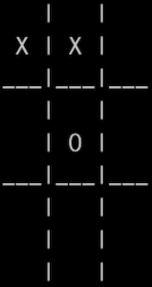

# AI Tic-Tac-Toe

This project consists of 4 different versions of a command-line AI tic-tac-toe opponent that get progressively better at playing against a human player by modifying the method used to decide on its best move. The best-performing version is *tic_tac_toe_minimax_tiebreak.py*, which provides a computer player that will never lose regardless of which player goes first, as well as leaving as many opportunities as possible for the human player to make mistakes.

# Background / tic_tac_toe_original.py
The initial version of this project, *tic_tac_toe_original.py* was actually written in 2015. I had never programmed before, so I decided to teach myself python by figuring out how to build a tic-tac-toe game that could play on its own, as the aspect of programming that intrigued me the most was how it seemed to capture logic and intelligence. 
The resulting program was able to never lose against a human player as long as it went first, but as I became more experienced with programming it was clear that the code was not very well organized or concise. In 2018 I decided to rewrite the program to challenge myself to build a better version that was shorter and one that could go second and still never lose.

# tic_tac_toe.py
This was my first rewrite of the tic-tac-toe program, which was able to achieve the same results while playing (never losing when going first) in 33% of the code (117 lines vs 357). In addition, the new version is better organized, so it's easier to understand how it works. By separating the SmartBoard class from the game and Board classes, further improvements on the decision making could be made by just creating a new class to inherit from Board with different bestMove and playMove methods while leaving both the Board and Game classes exactly the same.
However, while this version is much more concise and readable, the decision making doesn't actually improve on the previous version. To decide on the best move for a board, for every unused square the program keeps track of the number of Xs and Os in triads containing that square that aren't mixed between X and O. This is a direct measure of the value of a given square on the current turn, as playing on a square with an X - O count of 2 is a winning move, while playing on an X - O count of 1 forces the opponent's next move. When two squares have the same the same worth on the current turn, the worth of a square on the next turn is calculated by counting the net X - O count for all squares in triads containing the square that aren't mixed.
This works well for the mid and late game, but as it can only look 1 turn into the future and relies heavily on past placement of Xs, it isn't good at picking moves at the beginning of the game. This can be overcome in the case of going first by essentially hard-coding a good first move, as the default best move for the first turn is the square in the top-left. However, this limitation allows it to be tricked when the human player goes first. A better algorithm would have to be able to look more turns forward.

# tic_tac_toe_minimax.py
For this version, I looked up what sort of algorithms are actually used to solve this sort of problem. I encountered the concept of a minimax algorithm, where you find the best of the worst case scenarios for a player recursively to search possible game states up to the end of the game. I implemented a version of this algorithm to find the best move which enabled the computer to never lose even when going second, without any hard-coding initial moves. It also was simpler, only using 98 lines of code.
However, while this version satisfied both of my original criteria, I thought I could improve upon its decision making further in certain circumstances.
 -> 
In the case of the first board state when it's X's turn, the algorithm can't distinguish between possible moves that lead to a state where the best worst case scenario is a tie. As such, it chooses the first of such states, leading to the move in the second picture. However, this move leads to a guaranteed tie, as long as neither player makes the obvious mistake of ignoring two of the opponents characters in a line. There are other moves, such as playing in the bottom right corner, which lead to states where the best worst case is still a tie, but there are more opportunities for the human player to make non-obvious mistakes (such as then playing in the bottom left or top right squares); some way to decide between tied moves would improve the decision making.

# tic_tac_toe_minimax_tiebreak.py
To break ties between equal valued positions, when calculating the score for a board state for O, I added a small tiebreaking adjustment to the returned score calculated by summing the position scores for all possible moves and dividing by 100. The adjustment is small enough that it never outweighs the difference between a win, loss, or tie, but it would bias towards choices that left the human player more possible moves that would lead to a computer win.
The new behavior for the same scenario is
 -> 
With this move, if the human player then moves in the middle left or bottom left, the computer will be able to win. This is equally good to the move in the bottom right, as both leave two squares that would result in the computer winning (although the move the computer makes is one I never actually considered).

As such, the final version of the program is 29% as long as the original (102 lines rather than 357), is much more readable, will never lose regardless of who goes first, and leaves opportunities for the human player to make mistakes.